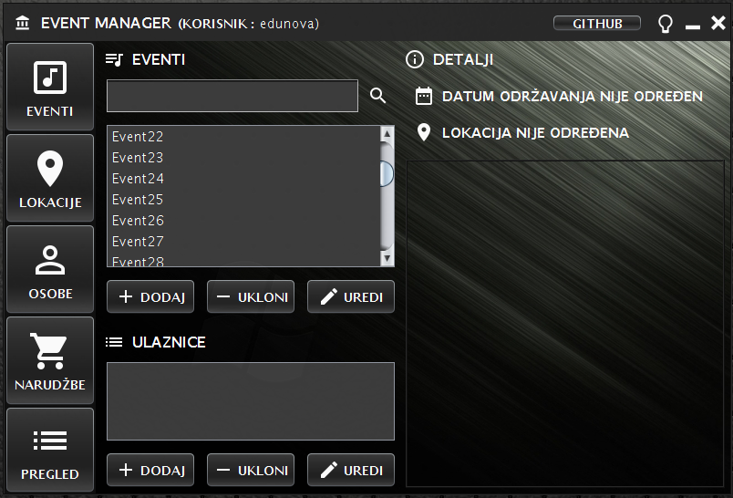
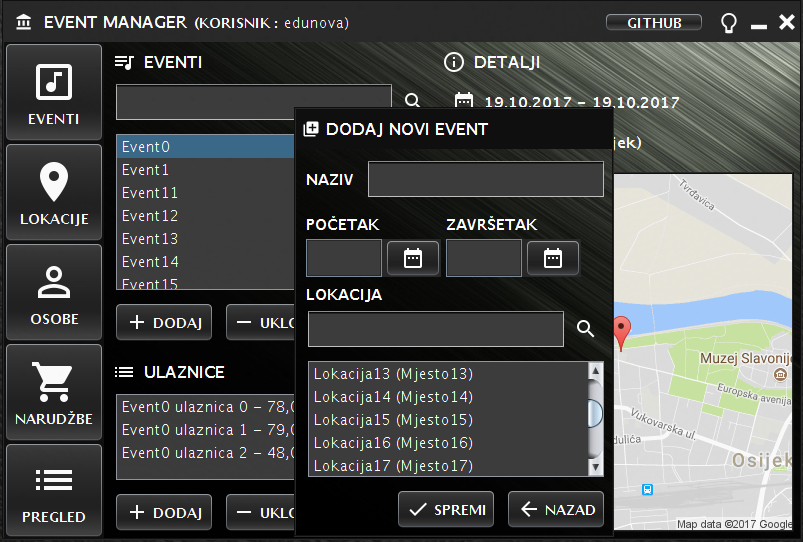
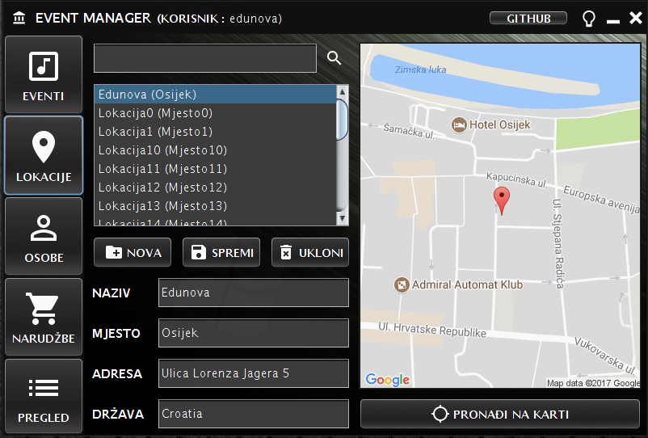
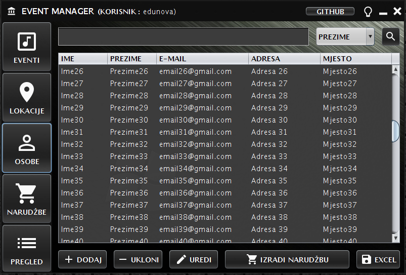
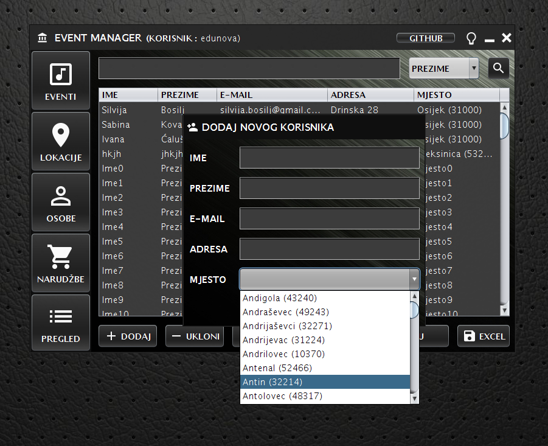
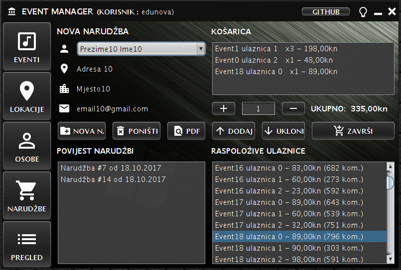
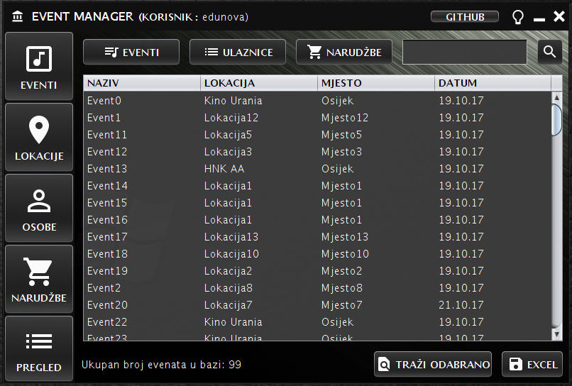
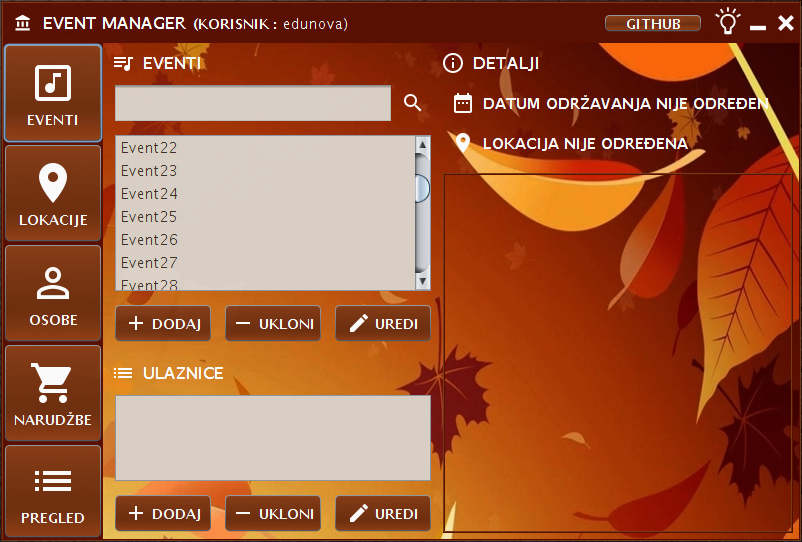

Event Manager je Java desktop aplikacija koja služi kao katalog glazbenih, kulturnih i drugih događanja i ulaznica te evidenciju narudžbi istih od strane korisnika. Korisničko sučelje aplikacije izrađeno je u Swing okruženju, dok se podaci spremaju u MySQL bazu podataka na lokalnom disku. Za posredstvo između korisničkog sučelja i baze odgovoran je Hibernate ORM.

## Korišteni alati

* Java i MySQL
* [Netbeans IDE](https://netbeans.org/)
* [Hibernate ORM](http://hibernate.org/orm/)
* Apache [PDFBox](https://pdfbox.apache.org/) i [POI](https://poi.apache.org/)
* Google [Static Maps](https://developers.google.com/maps/documentation/static-maps/) i [Geocoding](https://developers.google.com/maps/documentation/geocoding/intro) API

## Sažetak

Sama aplikacija sastoji se od glavnog prozora u kojem se izmjenjuje nekoliko panela, ovisno o kategoriji odabranoj u glavnom izborniku.

* Kategorija "Eventi" omogućava čitanje, unos, promjenu i brisanje eventa u/iz baze podataka (CRUD). Evente se može pretraživati i sortirati na različite načine. Svakom eventu moguće je dodjeliti datum i mjesto održavanja te pripadajuće ulaznice.

   
 

* U Kategoriji "Lokacije", uz CRUD, koriste si i Google-ovi Static Maps i Geocoding API-ji. Oni omogućavaju lociranje i iscrtavanje karte za određene koordinate, na osnovu naziva, adrese ili mjesta koje korisnik unese. 

 

* Kategorija "Osobe" odgovorna je za CRUD kupaca te sadrži popis naselja u Republici Hrvatskoj s pripadajućim poštanskim brojevima(preuzeto od [ndekic](https://github.com/ndekic/popis_naselja_u_republici_hrvatskoj))

   
 

* U kategoriji "Narudžbe" implementiran je jednostavan sustav izrade narudžbi putem košarice. Također je moguće narudžbe izraditi i pohraniti u PDF formatu.

 

* Kategorija "Pregled" sadrži sve bitne podatke na jednom mjestu u obliku tablica te omogućava brzo i jednostavno sortiranje i pretraživanje. Za svaku tablicu moguće je izraditi i pohraniti Excel datoteku.

 

* Za kraj, pritiskom na ikonu žarulje moguće je promjeniti vizualnu temu aplikacije:

